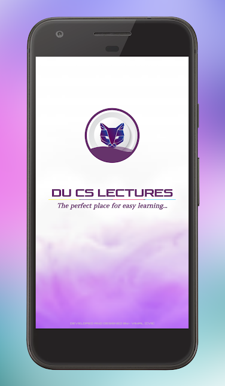
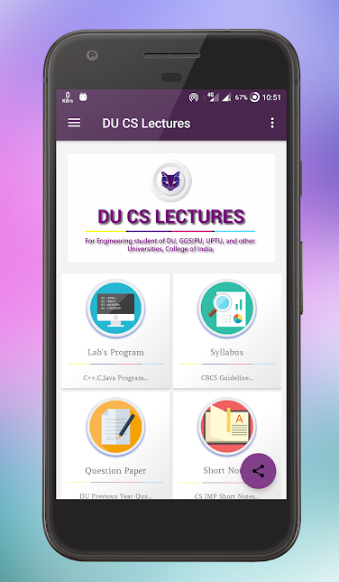
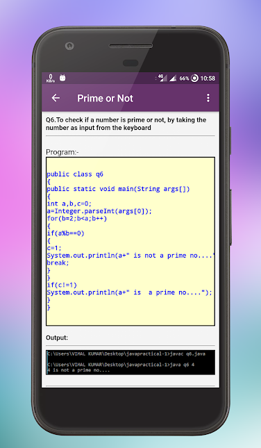
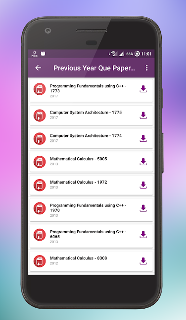

# DU CS Lectures - Learn to Code for Free
<b>DU CS Lectures</b>The perfect place of learning App.

This application has collection of  Computer Science Lab Programs. Video Lectures. DU's Books. Short Notes Previous year Question papers & Solutions absolutely FREE

----------

<b><b>SYLLABUS:</b></b>
     1. Programming Fundamentals using C++.
     2. Computer System Architecture.
     3. Programming in JAVA.
     4. Discrete Structures.
     5. Data Structures.
     6. Operating Systems.
     7. Computer Networks.
     8. Design and Analysis of Algorithms.
     9. Software Engineering.
     10. Database Management Systems.
     11. Internet Technologies.
     12. Theory of Computation.
     13. Artificial Intelligence.
     14. Computer Graphics.

	
<b>The Algorithms are from the following topics.</b> 
    📍 Arrays
    📍 Strings
    📍 Hashing
    📍 Sorting
    📍 Searching
    📍 Math
    📍 Stack
    📍 Heap
    📍 Tries
    📍 Trees
    📍 Greedy
    📍 Graphs
    📍 Union Find
    📍 Back Tracking
    📍 Two Pointers
    📍 Linked Lists
    📍 Implementation
    📍 Bit Manipulations
    📍 Divide and Conquer
    📍 Topological Sort
    📍 Depth First Search
    📍 Breadth First Search
    📍 Dynamic Programming

	
<b>Below are the features of this App:</b>	
    📍 More than 600 Lab Programs JAVA, C++, PHP, DS, OS, CSA, DAA, CG...,
    📍 More than 250 exam questions for last 10 years with solutions, 

 Download now in your mobiles & tablets it's FREE and Up your performance level!
 
No permission no ads. 
<b>Open source project in github</b> https://github.com/vimalcvs/ducslectures

### SCREENSHOTS

----------
